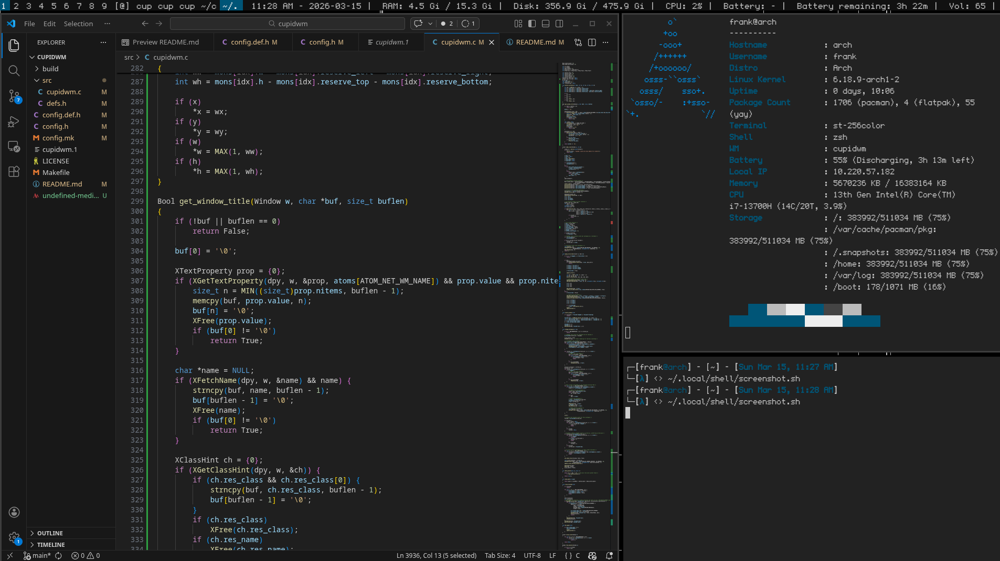

cupidwm
=======

`cupidwm` is a source-configured X11 window manager with workspace-driven tiling,
custom layouts, scratchpads, swallowing, monitor-aware behavior, and compile-time
configuration through `config.h`.

Screenshot
----------



Shown above is `cupidwm` running on Arch Linux on X11, with Visual Studio Code open,
`st` open, and `cupidfetch` open in a terminal.

Features
--------

- 9 fixed workspaces (`1`-`9`)
- Tile / monocle / floating / fibonacci / dwindle layouts
- Scratchpads (create/toggle/remove)
- Swallowing rules
- Multi-monitor support (Xinerama)
- EWMH basics (`_NET_CURRENT_DESKTOP`, `_NET_ACTIVE_WINDOW`, `_NET_WORKAREA`, etc.)
- Built-in Xlib bar (tags, layout symbol, clickable tabs, root-name or fallback status)
- Autostart command list from source
- Tab hide/restore on click (click focused tab to hide, click tab again to restore)
- Swallowed app tabs show the app title (e.g. terminal -> thunar shows a thunar tab)

Basic X11 Setup
---------------

You need an X11 stack plus build dependencies.

Required:
- Xorg server + `xinit`
- C compiler + `make`
- `libX11`, `libXinerama`, `libXcursor`, `libXft`, `fontconfig`, `freetype` development headers

Optional but recommended (default keybind commands use these):
- terminal (`st`)
- app launcher (`dmenu_run`)
- browser (`firefox`)

Examples:
- Debian/Ubuntu: install `xorg`, `xinit`, `build-essential`, `libx11-dev`, `libxinerama-dev`, `libxcursor-dev`, `libxft-dev`, `libfontconfig-dev`, `libfreetype6-dev`
- Arch: install `xorg-server`, `xorg-xinit`, `base-devel`, `libx11`, `libxinerama`, `libxcursor`, `libxft`, `fontconfig`, `freetype2`
- Fedora: install `xorg-x11-server-Xorg`, `xorg-x11-xinit`, `gcc`, `make`, `libX11-devel`, `libXinerama-devel`, `libXcursor-devel`, `libXft-devel`, `fontconfig-devel`, `freetype-devel`

Font note:
- Default bar font is `undefined-medium`. Install `undefined-medium.ttf` into your font path (then run `fc-cache -f`) or set `fontname` in `config.h` to another installed font.

Build and Install
-----------------

```sh
cd /home/frank/cupidwm/cupidwm
make
sudo make install
```

For a fully clean rebuild:

```sh
make clean
make
```

Optional font install target:

```sh
sudo make install-font
```

To run without installing:

```sh
./cupidwm
```

Testing
-------

`cupidwm` ships a Xephyr smoke test that exercises workspace switching, move-to-workspace, scratchpads, swallowing, and monitor focus/move flows.

Smoke test dependencies:
- `Xephyr`
- `xdpyinfo`
- `xprop`
- `xdotool`
- `xterm`
- `xwininfo`
- `awk`, `sed`, `grep`

Run tests:

```sh
cd /home/frank/cupidwm/cupidwm
make
make test-smoke
```

Equivalent direct invocation:

```sh
./scripts/smoke-xephyr.sh ./cupidwm
```

Optional:
- Set `DISPLAY_NUM` to avoid conflicts, for example: `DISPLAY_NUM=100 make test-smoke`

Important Hardening Notes (2026-03-15)
--------------------------------------

- `make install` manpage version replacement now uses `${VERSION}` from `config.mk` to avoid version drift.
- Build config now prefers `pkg-config` (`x11`, `xinerama`, `xcursor`, `xft`, `fontconfig`) and falls back to legacy `/usr/X11R6` paths when unavailable.
- Workspace switching now rejects invalid negative indices from external EWMH requests.
- Root `_NET_CURRENT_DESKTOP` and client `_NET_WM_*` property handling now validates type/format before use.
- `_NET_CLIENT_LIST` export now has an explicit `MAX_CLIENTS` guard to avoid writing beyond fixed buffers.
- Battery status fallback now auto-detects a battery under `/sys/class/power_supply` when configured `status_battery_path` is missing/unavailable.
- Monitor discovery now clamps to `MAX_MONITORS` and falls back safely if Xinerama reports invalid/empty monitor data.
- Client monitor assignments are re-clamped after monitor topology refresh to avoid stale/out-of-range monitor indices.
- `_NET_WORKAREA` export length now matches bounded monitor data to avoid out-of-bounds reads.
- Scratchpad assignment and per-monitor master-width controls now clamp unsafe indices.
- Source layout was refactored: `src/cupidwm.c` now includes focused modules (`src/input.c`, `src/layout.c`, `src/ewmh.c`, `src/status.c`, `src/bar.c`) to reduce monolith risk while preserving single-translation-unit behavior.
- Added CI (`.github/workflows/ci.yml`) with:
  - matrix builds (`gcc` + `clang`)
  - distro/container build coverage (`debian`, `fedora`, `arch`)
  - sanitizer builds (`ASan` + `UBSan`) with `-Werror`
  - static analysis (`cppcheck` + `clang-tidy` clang-analyzer checks)
  - expanded Xephyr smoke test (`scripts/smoke-xephyr.sh`) covering:
    - workspace switching
    - move-to-workspace
    - scratchpad create/toggle
    - swallowing behavior
    - monitor focus/move (with multi-monitor Xephyr fallback handling)
- Added `cupidwm.desktop` and install/uninstall handling so display managers can launch `cupidwm` from X sessions.

Start CupidWM With startx
-------------------------

Create `~/.xinitrc`:

```sh
#!/bin/sh

# optional status text for the bar
while xsetroot -name "$(date '+%a %b %d %H:%M')"; do
  sleep 5
done &

exec cupidwm
```

Then start your session:

```sh
startx
```

Default Keybindings
-------------------

`MOD` is `Super` (Windows key) by default.

Core:
- `MOD + Return`: launch terminal
- `MOD + p`: launcher (`dmenu_run`)
- `MOD + b`: browser
- `MOD + Shift + q`: close focused window
- `MOD + Shift + Escape`: quit CupidWM
- `MOD + Shift + r`: restart CupidWM

Layouts:
- `MOD + t`: tile
- `MOD + m`: monocle
- `MOD + f`: floating layout
- `MOD + r`: fibonacci
- `MOD + y`: dwindle
- `MOD + Space`: toggle floating (focused window)
- `MOD + Shift + Space`: toggle global floating

Movement / sizing:
- `MOD + j/k`: focus next/prev
- `MOD + Shift + j/k`: cycle master order
- `MOD + h/l`: shrink/grow master area
- `MOD + Ctrl + h/l`: shrink/grow focused stack client
- `MOD + Arrow keys`: move floating window
- `MOD + Shift + Arrow keys`: resize floating window

Workspaces:
- `MOD + 1..9`: switch workspace
- `MOD + Shift + 1..9`: move focused window to workspace
- `MOD + Tab`: previous workspace

Scratchpads:
- `MOD + Alt + 1..4`: create scratchpad slot
- `MOD + Ctrl + 1..4`: toggle scratchpad slot
- `MOD + Alt + Shift + 1..4`: remove scratchpad slot

Configuration and Keybinding Changes
------------------------------------

Configuration is source-based in `config.h`.

- First build creates `config.h` from `config.def.h`.
- After that, edit `config.h` directly for commands, layouts, rules, and keys.
- If you want to reset defaults: `cp config.def.h config.h`.

Rebuild after changes:

```sh
make clean
make
sudo make install
```

Bar and Status Options
----------------------

The bar behavior is fully configurable in `config.h`:

- `showbar`, `topbar`, `barheight`, `fontname`
- `tags[]` for workspace labels
- `bar_show_tabs` to enable per-window tabs in the title area
- `bar_click_focus_tabs` to focus windows by clicking tabs
- `bar_show_title_fallback` to show a single title when tabs are disabled/empty

Tab interaction behavior:

- Left-clicking a non-focused tab focuses that window.
- Left-clicking the focused tab hides (unmaps) that window.
- Hidden windows stay listed in tabs so they can be clicked again to restore.
- When a terminal swallows an app window, the visible app still appears as a normal tab title.

Built-in status behavior is also configurable:

- `status_interval_sec` update cadence (`0` disables periodic refresh)
- `status_use_root_name` to use `xsetroot -name` text when present
- `status_enable_fallback` to use built-in status when root name is empty
- `status_show_disk`, `status_show_disk_total`, `status_disk_path`, `status_disk_label`
- `status_show_cpu`, `status_cpu_label`
- `status_show_ram`, `status_ram_label`, `status_ram_show_percent`
- `status_show_battery`, `status_battery_path`, `status_battery_label`, `status_battery_show_state`
- `status_show_time`, `status_time_label`, `status_time_format` (strftime format)
- `status_section_order` to control fallback section order (tokens: `disk`, `cpu`, `ram`, `battery`, `time`)
- `status_separator` between fallback status sections

`status_section_order` accepts comma/space separated tokens, for example:

- `"battery,time,cpu,ram,disk"`

Disabled/unavailable sections are automatically omitted.

Mouse focus behavior is configurable too:

- `focus_follows_mouse` enables/disables hover-to-focus (DWM-style)

Project Layout
--------------

- `src/`: core source split by concern:
  - `cupidwm.c` (core runtime + shared state)
  - `input.c` (X event handlers)
  - `layout.c` (tiling/layout transitions)
  - `ewmh.c` (EWMH atoms/properties)
  - `status.c` (status generation/text metrics)
  - `bar.c` (bar setup/render/click mapping)
  - `defs.h` (shared structs/macros)
- `scripts/`: helper scripts (including Xephyr smoke test)
- `.github/workflows/`: CI definitions
- `config.def.h`: default source configuration template
- `config.h`: active local configuration
- `cupidwm.1`: man page source

License
-------

GPLv3. See `LICENSE`.
