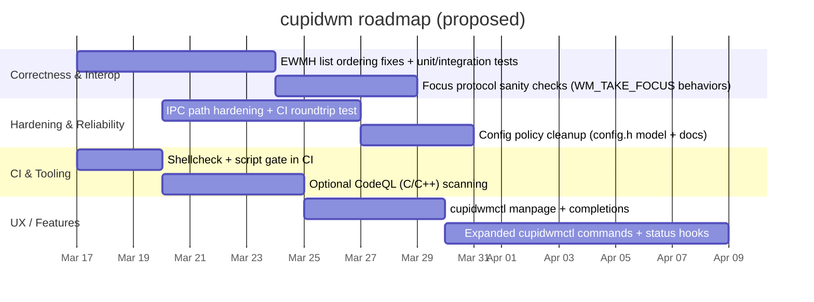
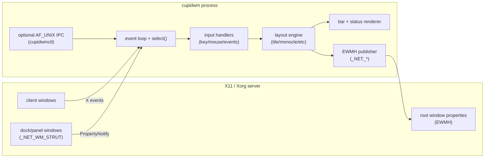

# Deep Research Audit and Roadmap for cupidthecat/cupidwm

## Executive summary

Enabled connectors reviewed: **GitHub**.  

The cupidthecat/cupidwm repository implements a compact, source-configured **X11 tiling window manager** written in C, with workspaces, multiple layouts, scratchpads, swallowing, a built-in bar and status system, optional local IPC (`cupidwmctl`), and a Xephyr-based integration test suite. fileciteturn5file0L1-L1 fileciteturn7file0L1-L1 fileciteturn25file0L1-L1 fileciteturn20file0L1-L1

The repository already has a strong “hygiene baseline” for an early-stage WM project: a conventional `Makefile` with `debug` sanitizer builds and `dist`/`distcheck`, Xephyr smoke tests plus an EWMH invariant suite, and a GitHub Actions CI workflow. fileciteturn7file0L1-L1 fileciteturn21file0L1-L1 fileciteturn33file0L1-L1

The highest-value next fixes are about **spec-accurate EWMH publication**, **operational hardening of optional IPC**, and **eliminating configuration/documentation ambiguity** (e.g., `config.h` policy, README vs docs). EWMH’s root-property requirements are explicit about list ordering and semantics—especially `_NET_CLIENT_LIST` vs `_NET_CLIENT_LIST_STACKING`. citeturn7search0

A pragmatic roadmap (6–10 weeks) can deliver:
- Correct EWMH ordering for client lists, plus test coverage that proves it. citeturn7search0
- IPC robustness improvements (especially around `/tmp` fallback behavior) while keeping IPC disabled-by-default. fileciteturn16file0L1-L1 fileciteturn32file0L1-L1
- CI upgrades (shellcheck, more deterministic Xephyr runs, optional CodeQL), and packaging polish (manpage for `cupidwmctl`, clearer “supported distros” and dependencies). fileciteturn33file0L1-L1 fileciteturn39file0L1-L1
- A feature tranche centered on usability and automation: richer `cupidwmctl` commands, status-provider improvements, and better “interop” predictability with panels/pagers via EWMH/ICCCM behavior. fileciteturn25file0L1-L1 citeturn5search0

## Repository baseline assessment

### Structure and build system

The build is Makefile-driven and intentionally “dwm-like” (source configuration via `config.h`/`config.def.h`, no heavy build tooling). It supports normal builds, sanitizer debug builds, linting via `cppcheck` when present, and test targets for smoke and EWMH invariants. fileciteturn7file0L1-L1

Dependencies are classic Xlib-era libraries: X11, Xinerama, Xrandr, Xcursor, Xft, Fontconfig (and transitive Freetype). The project uses `pkg-config` (with legacy fallbacks) for compile/link flags. fileciteturn8file0L1-L1

The source is split into module files included into a single translation unit (e.g., `cupidwm.c` includes `status.c`, `bar.c`, `ewmh.c`, `ipc.c`, etc.), which can work well for static linkage and simplicity, but it also means “global state everywhere” and makes certain kinds of unit testing harder. fileciteturn11file0L1-L1

### Documentation and “user journey”

The repo contains:
- A top-level README plus additional docs (configuration, compatibility/EWMH surface, IPC, release notes). fileciteturn5file0L1-L1 fileciteturn30file0L1-L1 fileciteturn31file0L1-L1 fileciteturn32file0L1-L1 fileciteturn34file0L1-L1
- A man page for the WM (`cupidwm.1`), but no installed man page for `cupidwmctl` despite the code and docs describing it. fileciteturn39file0L1-L1 fileciteturn25file0L1-L1 fileciteturn32file0L1-L1
- A release tarball workflow (`make dist` + `distcheck`) that includes docs/tests/tools/assets and third-party notices. fileciteturn7file0L1-L1 fileciteturn34file0L1-L1

The big documentation risk is **policy ambiguity** (what is “local config” vs “repo default config,” and what users are expected to edit). The build rule creates `config.h` from `config.def.h`, yet the repository also contains `config.h`, and docs describe it as a local generated file. This inconsistency is a common source of “I edited the wrong file” and “my changes got overwritten” confusion. fileciteturn7file0L1-L1 fileciteturn46file0L1-L1 fileciteturn30file0L1-L1

### Testing and CI

The test strategy is integration-heavy:
- A Xephyr smoke test validating workspace, scratchpad, swallowing, and monitor behaviors. fileciteturn20file0L1-L1
- A second Xephyr-based EWMH invariants suite validating key root properties and behaviors (e.g., `_NET_SUPPORTED`, desktop metadata, and _NET_WORKAREA response to struts). fileciteturn21file0L1-L1

CI runs builds and checks in GitHub Actions, which is a strong baseline for a system-level C project. fileciteturn33file0L1-L1

### Spec compliance and interop surface (EWMH/ICCCM)

The project explicitly documents which EWMH root properties and client behaviors it supports, including `_NET_CLIENT_LIST`, `_NET_CLIENT_LIST_STACKING`, `_NET_WORKAREA`, and dock strut handling. fileciteturn31file0L1-L1

The EWMH spec requires `_NET_CLIENT_LIST` to be in initial mapping order and `_NET_CLIENT_LIST_STACKING` to be in bottom-to-top stacking order. citeturn7search0  
That ordering requirement is often missed in WMs, but it affects pagers, taskbars, and “focus last” heuristics.

Separately, ICCCM defines input focus conventions and the WM_TAKE_FOCUS protocol; robust focus behavior matters for compatibility with “globally active” clients and focus-stealing avoidance patterns. citeturn5search0

### Security posture and dependency reality

The repository includes an explicit security policy emphasizing that the WM’s security posture depends on system-provided X11 libraries and that users must keep `libX11` patched. fileciteturn26file0L1-L1

This is well-founded: historical and recent `libX11` vulnerabilities include CVE-2020-14363 (integer overflow leading to double-free) and CVE-2025-26597 (buffer overflow in XKB handling, tied to `XkbChangeTypesOfKey()`). citeturn6search0turn7search1  
Because cupidwm links against the system `libX11`, the primary mitigation is timely distro updates, not vendoring. fileciteturn26file0L1-L1

The project also includes third-party licensing documentation for a bundled font (OFL 1.1) and includes license text, which is good distribution hygiene. fileciteturn27file0L1-L1 fileciteturn24file0L1-L1

## Prioritized bugs, missing features, and actionable fixes

Severity scale used:
- **Critical**: breakage, security hardening gaps that can brick core features, or spec violations known to break interoperability.
- **High**: frequent UX regressions, correctness issues likely to affect users/panels/pagers.
- **Medium**: paper cuts, maintainability debt, portability gaps.
- **Low**: polish.

Effort scale:
- **S** (1–2 days), **M** (3–7 days), **L** (1–3+ weeks).

### Priority table

| Priority | Type | Item | Why it matters | Severity | Effort | Impact |
|---:|---|---|---|---|---|---|
| P0 | Bug / Spec | Fix `_NET_CLIENT_LIST` and `_NET_CLIENT_LIST_STACKING` ordering | EWMH mandates mapping-order vs stacking-order; wrong ordering breaks pagers/taskbars heuristics | Critical | M | High |
| P0 | Hardening | Make IPC `/tmp` fallback robust (avoid trivial DoS and ambiguous ownership) | Optional IPC should not be fragile on multi-user systems; keep “disabled-by-default” stance | High | M | High |
| P1 | Repo hygiene | Resolve `config.h` policy (tracked vs generated) + ensure `.gitignore` matches | Prevent user confusion and accidental “config drift”; makes packaging more predictable | High | S–M | High |
| P1 | Docs | Add `cupidwmctl(1)` man page + keep IPC docs aligned | Reduces hidden features; improves CLI discoverability | Medium | S | Medium |
| P1 | CI | Add shellcheck to script gate + strengthen determinism of Xephyr tests | Prevents CI-only regressions and shell portability hazards | Medium | S | Medium |
| P2 | Feature | Expand IPC command surface (gaps/layout/bar/status hooks) | Enables automation without restart; complements “minimal WM” story | Medium | M | Medium–High |
| P2 | Test | Add EWMH ordering tests + focus protocol tests (WM_TAKE_FOCUS behavior) | Prevent future regressions; increases WM compatibility | Medium | M | Medium |
| P3 | Packaging | Add completions (bash/zsh) and optional systemd user service templates | Improves UX for power users; optional, non-invasive | Low | M | Medium |

The rest of this section details the top items with code-level implementation guidance.

### Critical fix: Correct EWMH client list publication

**What’s wrong / likely wrong:**  
EWMH explicitly distinguishes `_NET_CLIENT_LIST` (initial mapping order) vs `_NET_CLIENT_LIST_STACKING` (bottom-to-top stacking order). citeturn7search0  
If cupidwm builds these lists by iterating internal workspace/client lists, it is very easy for `_NET_CLIENT_LIST` to become “newest first” (because many WMs push new clients at the head of a list), and for `_NET_CLIENT_LIST_STACKING` to simply duplicate that list. That yields spec-noncompliant order even if the membership is correct. citeturn7search0 fileciteturn17file0L1-L1

**Recommended design change (minimal structural disruption):**
1. Add a monotonically increasing `map_seq` to `Client`. Set it on `add_client()`.
2. For `_NET_CLIENT_LIST`, gather all managed clients and sort by `map_seq` ascending.
3. For `_NET_CLIENT_LIST_STACKING`, get root children via `XQueryTree()` which returns children in stacking order bottom-most to top-most. citeturn9search1  
   Filter to managed clients and use that order (then append any managed clients not found).

**Pseudo-diff (illustrative, not exact line numbers):**
```diff
diff --git a/src/defs.h b/src/defs.h
@@
 typedef struct Client {
+    unsigned long map_seq;
     Window win;
     ...
 } Client;

diff --git a/src/cupidwm.c b/src/cupidwm.c
@@
 static unsigned long g_map_seq = 1;

 Client *add_client(Window w, int ws)
 {
     Client *c = calloc(1, sizeof(Client));
     ...
+    c->map_seq = g_map_seq++;
     ...
 }

diff --git a/src/ewmh.c b/src/ewmh.c
@@
 void update_net_client_list(void)
 {
-    // current implementation builds `wins[]` from internal lists
-    XChangeProperty(dpy, root, atoms[ATOM_NET_CLIENT_LIST], XA_WINDOW, 32, PropModeReplace,
-                    (unsigned char *)wins, n);
-    XChangeProperty(dpy, root, atoms[ATOM_NET_CLIENT_LIST_STACKING], XA_WINDOW, 32, PropModeReplace,
-                    (unsigned char *)wins, n);
+    Window map_list[MAX_CLIENTS];
+    Window stack_list[MAX_CLIENTS];
+    size_t n_map = 0, n_stack = 0;
+
+    // 1) Collect all managed clients into temporary array of Client*
+    // 2) Sort by c->map_seq ascending; fill map_list in that order
+    // 3) Use XQueryTree(root) children order (bottom->top) to fill stack_list
+    // 4) Append any managed clients missing from stack_list
+
+    XChangeProperty(dpy, root, atoms[ATOM_NET_CLIENT_LIST], XA_WINDOW, 32, PropModeReplace,
+                    (unsigned char *)map_list, (int)n_map);
+    XChangeProperty(dpy, root, atoms[ATOM_NET_CLIENT_LIST_STACKING], XA_WINDOW, 32, PropModeReplace,
+                    (unsigned char *)stack_list, (int)n_stack);
 }
```

**Why this is the right approach:**
- It directly implements the EWMH-required ordering. citeturn7search0
- It uses `XQueryTree()` specifically for stacking order, which explicitly provides bottom-to-top stacking order. citeturn9search1
- It keeps internal WM logic mostly unchanged while making EWMH output correct.

**Test changes you should add immediately:**
Expand the EWMH invariants suite to assert:
- `_NET_CLIENT_LIST` preserves first-mapped order across new window creation.
- `_NET_CLIENT_LIST_STACKING` changes when you raise/focus different windows.

You already have a Xephyr harness that creates two windows and checks list membership. Extend it by opening A then B, verifying A appears before B in `_NET_CLIENT_LIST`, then raising A and verifying the stacking order changes appropriately. fileciteturn21file0L1-L1 citeturn7search0

### High fix: Harden IPC socket path behavior

cupidwm’s IPC server is explicitly optional and disabled by default (good). fileciteturn32file0L1-L1 fileciteturn46file0L1-L1  
However, the common fallback pattern “`/tmp/cupidwm-<uid>.sock`” is vulnerable to multi-user denial-of-service and poor diagnostics if an unexpected file exists at that path. The code currently unlinks the socket path before binding. fileciteturn16file0L1-L1

**Recommended changes:**
- Prefer `$XDG_RUNTIME_DIR` strongly (it is per-user and typically `0700`), as you already do. fileciteturn16file0L1-L1
- If `$XDG_RUNTIME_DIR` is missing, create a per-user directory under `/tmp`:
  - `/tmp/cupidwm-<uid>/cupidwm.sock`
  - `mkdir` with mode `0700`
  - Refuse to use the directory if not owned by the user or not private.
- Improve error messages: distinguish “path exists but is not removable” vs “bind failed.”

**Design rationale:**  
AF_UNIX IPC is “local only,” but correctness and predictability still matter. Keeping IPC disabled-by-default is consistent with the repo’s security stance. fileciteturn26file0L1-L1 fileciteturn32file0L1-L1

**Suggested follow-on:** add a CI-only config enabling IPC and run a minimal `cupidwmctl ping` roundtrip test (details in the CI section). fileciteturn25file0L1-L1 fileciteturn16file0L1-L1

### High fix: Resolve configuration policy ambiguity (`config.h`)

The Makefile rule suggests `config.h` is generated from `config.def.h` on first build. fileciteturn7file0L1-L1  
But `config.h` exists in-repo and is effectively a “default config” snapshot. fileciteturn46file0L1-L1

You should pick one clear model and enforce it.

**Option A (recommended, dwm-like):**
- Track only `config.def.h`.
- Do **not** track `config.h` (remove it from the repository).
- Add/confirm `.gitignore` ignores `config.h`, build outputs, generated artifacts.
- Update docs to say: copy `config.def.h` → `config.h`, edit `config.h`, rebuild. fileciteturn30file0L1-L1

**Option B (less common, “single config file”):**
- Track only `config.h` (make it the official config).
- Delete `config.def.h` or treat it as purely documentation.
- Remove the `config.h:` auto-generation rule to avoid surprising overwrites. fileciteturn7file0L1-L1

Given the repository already has `config.def.h` and docs describing the template model, Option A is the shorter path to clarity. fileciteturn9file0L1-L1 fileciteturn30file0L1-L1

### Medium fix: `cupidwmctl` discoverability (man page + completions)

The project ships a `cupidwmctl` tool and documents IPC commands and behavior, but it does not install a corresponding man page. fileciteturn25file0L1-L1 fileciteturn32file0L1-L1 fileciteturn7file0L1-L1

Add `cupidwmctl.1`:
- Usage synopsis, socket path rules, exit codes, commands.
- Examples matching docs.

Then update the Makefile install target to install it alongside `cupidwm.1`. fileciteturn7file0L1-L1

### Medium fix: Script linting and CI improvements

You have critical scripts driving tests and dependency installation. fileciteturn19file0L1-L1 fileciteturn20file0L1-L1 fileciteturn21file0L1-L1  
CI should add:
- `shellcheck` across `scripts/*.sh` and `tests/**/*.sh`.
- More explicit tool availability checks (some are present already in scripts). fileciteturn21file0L1-L1

## Implementation roadmap with milestones and timelines

Assumptions (unspecified in repo context):
- Target users: Linux/X11 users who want a lightweight tiling WM with compile-time config, similar ergonomics to dwm-like workflows. fileciteturn5file0L1-L1
- Deployment: local desktop session via `startx` or display manager; optional Xsession `.desktop`. fileciteturn5file0L1-L1 fileciteturn40file0L1-L1
- Out of scope unless stated: Wayland support.

### Proposed milestone plan



This plan intentionally front-loads interop correctness because regressions there are the hardest for users to diagnose (“my panel/pager behaves weirdly”). citeturn7search0

### Architecture/workflow sketch



The design matches what’s in the split modules and the select-driven loop that optionally watches both the X connection and the IPC server fd. fileciteturn11file0L1-L1 fileciteturn16file0L1-L1

## Testing and CI recommendations

### Expand integration tests where they are strongest

You already have a good foundation for an X11 WM: Xephyr-based behavioral tests. fileciteturn20file0L1-L1 fileciteturn21file0L1-L1  
Rather than adding heavyweight unit-test frameworks immediately, squeeze more correctness from these integration suites:

1. **EWMH ordering assertions**
   - Add order checks for `_NET_CLIENT_LIST` mapping order and `_NET_CLIENT_LIST_STACKING`. EWMH defines both. citeturn7search0
   - Use `XQueryTree` knowledge to craft stacking expectations when raising and focusing windows. citeturn9search1

2. **Focus protocol correctness checks (ICCCM)**
   - Add a test client that advertises `WM_TAKE_FOCUS` and verify cupidwm sends it appropriately when focusing (if you implement it; if not, explicitly document you don’t). ICCCM defines the conventions and why they matter. citeturn5search0

3. **IPC roundtrip test (CI-only)**
   - Add a CI step that builds with `ipc_enable=1` and a deterministic socket path under `$XDG_RUNTIME_DIR`, runs cupidwm under Xephyr, then executes `cupidwmctl ping` and `cupidwmctl status`. fileciteturn16file0L1-L1 fileciteturn25file0L1-L1

### CI workflow upgrades

Your CI already builds and runs checks. fileciteturn33file0L1-L1  
Recommended additions:
- **Shellcheck stage** for scripts (`scripts/*.sh`, `tests/**/*.sh`), failing on findings. (Your scripts already try to be strict bash; enforce it consistently.) fileciteturn20file0L1-L1 fileciteturn21file0L1-L1
- **Artifact capture**: on test failure, upload Xephyr logs and WM logs (you already hint at log usage in scripts; make it first-class in CI). fileciteturn20file0L1-L1 fileciteturn21file0L1-L1
- **Optional static security analysis**: add CodeQL scanning for C/C++ once the repo stabilizes. This is especially helpful for IPC parsing and X property parsing code paths. fileciteturn16file0L1-L1 fileciteturn17file0L1-L1

## Dependency, security, and release/distribution plan

### Dependency plan

cupidwm depends primarily on system X11 libraries and headers (not vendored). fileciteturn8file0L1-L1  
This implies:
- The project should **avoid pinning** versions in-repo and instead document “known good” minima and recommended distros/toolchains.
- The primary maintenance duty is keeping build metadata (`pkg-config` checks) and install scripts aligned with actual requirements. fileciteturn8file0L1-L1 fileciteturn19file0L1-L1

Actionable improvements:
- Update `scripts/install-deps.sh` to include any missing headers implied by `config.mk` (e.g., Xrandr development packages if they’re required by default). fileciteturn8file0L1-L1 fileciteturn19file0L1-L1
- Document a “minimum supported `libX11` version” for sanity (even if loose). CVE-2020-14363 affects libX11 prior to 1.6.12 per advisory sources; this is relevant historical context. citeturn6search0

### Security upgrade plan

The repository explicitly calls out that patching `libX11` is required maintenance, with concrete examples. fileciteturn26file0L1-L1

Operational recommendations:
- In docs, advise users to ensure they have fixes for:
  - **CVE-2020-14363** (libX11 double-free path). citeturn6search0
  - **CVE-2025-26597** (XKB buffer overflow path). citeturn7search1
- For distros, link to distro security trackers (e.g., Ubuntu’s CVE page for CVE-2020-14363 shows fixed package versions per release). citeturn6search5
- Keep IPC disabled by default (already the case) and be explicit about threat model: local user session only. fileciteturn32file0L1-L1 fileciteturn46file0L1-L1

### Licensing and redistribution readiness

Core code is GPLv3 per repository license. fileciteturn6file0L1-L1  
Bundled font assets are documented with provenance and licensed under SIL OFL 1.1, with license text included. fileciteturn27file0L1-L1 fileciteturn24file0L1-L1

Recommended additions for packagers:
- Add SPDX headers in source files (optional but helpful).
- Add a “License summary” section in README pointing to both GPL and the third-party notice.

### Packaging/distribution enhancements

Strengths:
- `make install` installs the WM binary, man page, and an Xsession `.desktop` file; `make dist` and `distcheck` exist and include lots of relevant material. fileciteturn7file0L1-L1 fileciteturn40file0L1-L1

Gaps:
- No installed man page for `cupidwmctl`. fileciteturn25file0L1-L1
- No shell completions, which are low-cost and high-value for a command tool with a small verb set.

## New features with rationale and mock UX/API

### UX grounding

The project’s bar model includes tabs and click behavior and a fallback status system, with optional root-name status. fileciteturn46file0L1-L1 fileciteturn12file0L1-L1 fileciteturn13file0L1-L1

image_group{"layout":"carousel","aspect_ratio":"16:9","query":["cupidwm window manager screenshot","X11 tiling window manager bar tabs","Xephyr X11 nested server window manager test"] ,"num_per_query":1}

### Feature table

| Feature | Rationale | Suggested surface | Effort | Impact |
|---|---|---|---|---|
| Richer `cupidwmctl` commands (toggle bar, set gaps, cycle layout, focus/move by window id) | Enables automation (scripts, hotkeys, status bars) without restarts | `cupidwmctl bar toggle`, `cupidwmctl gaps +5`, `cupidwmctl focus 0x....` | M | High |
| IPC “query” mode returning JSON | Makes it easy to integrate with status bars/pagers | `cupidwmctl -j status` → JSON | M | Medium–High |
| Status provider: multiple external commands + timeout | Prevents hangs and supports modular status composition | `status_external_cmds[]` + `status_cmd_timeout_ms` | M | Medium |
| Declarative rules improvements (regex title matching, per-workspace defaults) | Simplifies configuration; reduces “special cases” | Extend `Rule` struct + match helpers | M | Medium |
| EWMH enhancements: `_NET_WM_STATE` expansion, urgency hints | Better interop with apps/pagers | Add atoms + logic; document in compatibility.md | M–L | Medium |

### Mock API/UX for `cupidwmctl`

Keep the existing terse verb-noun pattern and add a stable “help” output.

Proposed CLI grammar:
- `cupidwmctl status` (already) fileciteturn25file0L1-L1
- `cupidwmctl help` (already) fileciteturn16file0L1-L1
- New:
  - `cupidwmctl bar toggle`
  - `cupidwmctl gaps set 10`
  - `cupidwmctl gaps inc 2`
  - `cupidwmctl layout next`
  - `cupidwmctl focus win 0x0120007a`
  - `cupidwmctl list clients` (returns window ids + workspace + title)

If you add JSON:
- `cupidwmctl -j status` → `{"workspace":1,"monitor":0,"focused":"0x...","layout":"tile"}`

### Where to implement features cleanly

- Extend IPC dispatcher in `src/ipc.c` for new verbs; keep replies line-oriented and small (you already do this). fileciteturn16file0L1-L1
- Extend `cupidwmctl` to build commands and support flags like `-j`. fileciteturn25file0L1-L1
- For “query client list,” leverage the same internal traversal you use for EWMH updates, but return a filtered, stable ordering (prefer `_NET_CLIENT_LIST` mapping order once fixed). citeturn7search0

## Repo source pointers for the highest-impact work

Copy/paste reference links (search within the file for the function names noted):

```text
Makefile:
https://github.com/cupidthecat/cupidwm/blob/main/Makefile

EWMH implementation:
https://github.com/cupidthecat/cupidwm/blob/main/src/ewmh.c
(search: update_net_client_list)

IPC server:
https://github.com/cupidthecat/cupidwm/blob/main/src/ipc.c
(search: ipc_setup)

Main WM + module includes:
https://github.com/cupidthecat/cupidwm/blob/main/src/cupidwm.c

IPC client tool:
https://github.com/cupidthecat/cupidwm/blob/main/tools/cupidwmctl.c

EWMH invariants test:
https://github.com/cupidthecat/cupidwm/blob/main/tests/ewmh/invariants.sh

Smoke test:
https://github.com/cupidthecat/cupidwm/blob/main/scripts/smoke-xephyr.sh

CI workflow:
https://github.com/cupidthecat/cupidwm/blob/main/.github/workflows/ci.yml

Security policy:
https://github.com/cupidthecat/cupidwm/blob/main/SECURITY.md
```

## External primary references used for recommendations

- EWMH root window properties and ordering requirements for `_NET_CLIENT_LIST` and `_NET_CLIENT_LIST_STACKING`. citeturn7search0
- Xlib `XQueryTree()` documentation: children are returned in current stacking order bottom-most to top-most (useful for `_NET_CLIENT_LIST_STACKING`). citeturn9search1
- ICCCM input focus conventions and WM_TAKE_FOCUS protocol guidance (to avoid focus interoperability regressions). citeturn5search0
- `libX11` vulnerability references (dependency patching reality):
  - CVE-2020-14363 (double-free chain). citeturn6search0
  - CVE-2025-26597 (XKB buffer overflow). citeturn7search1